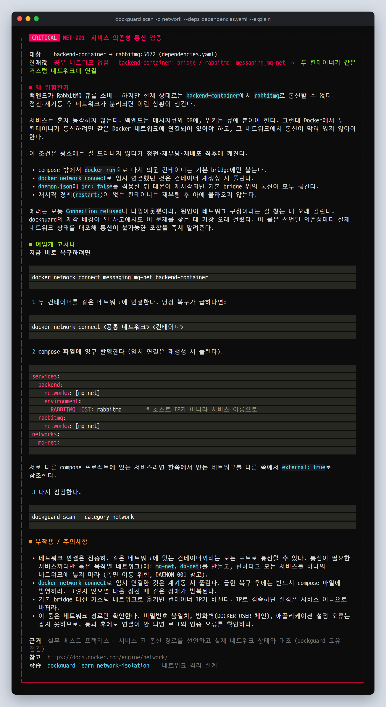

# 데모: 정전 후 "왜 연결이 안 되지?"를 5분 안에 찾기

dockguard의 핵심 시나리오를 처음부터 끝까지 따라가 봅니다. 제작자가 실제로 겪은 사고를 그대로 재현한 예시(`examples/rabbitmq-incident/`)를 씁니다.

- **실제 Docker가 있다면** → [A. 내 PC에서 실제로 재현하기](#a-내-pc에서-실제로-재현하기)
- **Docker가 없다면** → [B. 스냅샷으로 따라 하기](#b-스냅샷으로-따라-하기) (저장소에 포함된 서버 상태 파일 사용)

---

## 상황

메시징 스택이 돌아가는 서버가 **정전으로 재부팅**됐습니다. 전원이 돌아온 뒤 대부분의 컨테이너는 올라왔지만 몇 가지가 이상합니다.

| 서비스 | 역할 | 사고 후 상태 |
|--------|------|--------------|
| `rabbitmq` | 메시지 브로커 (compose 프로젝트 `messaging`) | 실행 중. 단, 5672/15672가 `0.0.0.0`에 열려 있음 |
| `service-manager` | 메시지 발행 | 실행 중 |
| `report-worker` | 리포트 작업 소비, 결과를 Redis에 캐시 | 실행 중 |
| `redis` | 캐시 | **재시작 정책이 없어 재부팅 후 올라오지 않음** |
| `backend-container` | 큐 소비 | 급하게 복구하느라 compose 밖에서 **`docker run`으로 다시 띄움** → 기본 bridge에만 연결 |

그리고 `daemon.json`에는 보안 강화 작업 때 넣은 `"icc": false`가 있습니다.

**증상**: 백엔드 로그에는 이것뿐입니다.

```
[backend] AMQPConnectionError: [Errno 111] Connection refused (rabbitmq:5672)
[report-worker] redis.exceptions.ConnectionError: Error -2 connecting to redis:6379. Name or service not known.
```

RabbitMQ는 떠 있고, 비밀번호도 맞고, 방화벽도 열었는데 왜 안 될까요? 제작자는 이 원인을 찾는 데 며칠이 걸렸습니다.

---

## 1단계: 의존성 선언

"누가 누구에게 붙어야 하는가"를 적어 둡니다. 예시에는 이미 준비되어 있습니다.

```yaml
# examples/rabbitmq-incident/dependencies.yaml
dependencies:
  - from: "backend-container"
    to: "rabbitmq"
    port: 5672
    reason: "백엔드가 RabbitMQ 큐를 소비"

  - from: "service-manager"
    to: "rabbitmq"
    port: 5672
    reason: "서비스 매니저가 메시지 발행"

  - from: "report-worker"
    to: "redis"
    port: 6379
    reason: "리포트 워커가 작업 결과를 캐시"
```

`from` / `to`에는 컨테이너 이름이나 compose 서비스 이름을 씁니다. compose 파일의 `depends_on`은 선언하지 않아도 자동으로 검증됩니다.

---

## A. 내 PC에서 실제로 재현하기

Docker가 있는 Linux · macOS · WSL에서 실행합니다. 가벼운 `alpine` 컨테이너만 만들고, 끝나면 정리 스크립트로 지웁니다.

```bash
bash examples/rabbitmq-incident/reproduce.sh
```

```
▶ 네트워크 messaging_mq-net 생성 (compose 프로젝트 messaging의 mq-net)
▶ rabbitmq — 5672/15672를 0.0.0.0에 공개한 채로 기동 (NET-004)
▶ service-manager, report-worker — 같은 네트워크에서 정상 기동
▶ redis — 재시작 정책이 없어 재부팅 후 올라오지 않은 상태 (생성만 됨)
▶ backend-container — 장애 복구 중 compose 밖에서 docker run으로 다시 띄움 (기본 bridge에만 연결)
```

진단합니다.

```bash
dockguard scan -c network --deps examples/rabbitmq-incident/dependencies.yaml
```

> 이 시나리오는 GitHub Actions의 [E2E 잡](../.github/workflows/ci.yml)에서 **매 커밋마다 실제 Docker로** 재현 · 검증됩니다
> (Docker SDK 경로와 docker CLI 폴백 경로 모두).

## B. 스냅샷으로 따라 하기

Docker가 없어도 됩니다. 사고 직후 서버에서 떠 온 상태 파일로 똑같이 진단합니다.

```bash
dockguard scan -c network \
  --docker-snapshot examples/rabbitmq-incident/snapshot.json \
  --deps examples/rabbitmq-incident/dependencies.yaml \
  --daemon-config examples/rabbitmq-incident/daemon.json
```

---

## 2단계: 결과 읽기


위에서부터 읽으면 원인이 바로 보입니다.

| 결과 | 의미 |
|------|------|
| **NET-001 취약** `backend-container → rabbitmq:5672` — 공유 네트워크 없음 | 백엔드는 `bridge`, RabbitMQ는 `messaging_mq-net`. **두 컨테이너가 같은 네트워크에 없어서** 애초에 통신 경로가 없습니다. 비밀번호나 방화벽 문제가 아니었습니다. |
| **NET-001 취약** `report-worker → redis:6379` — 실행 중이 아님 | Redis가 멈춰 있고 **재시작 정책이 `no`** 입니다. 재부팅 후 자동으로 올라오지 않은 것입니다. |
| **NET-004 취약** RabbitMQ 5672/15672가 `0.0.0.0`에 노출 | 통신 장애와는 별개로, 외부에서 RabbitMQ에 직접 접속할 수 있는 상태입니다. |
| **NET-003 주의** 기본 bridge에 2개가 있지만 `icc: false`로 통신 불가 | 백엔드가 기본 bridge에 떨어져 있는데, 거기서는 `icc: false` 때문에 다른 컨테이너와도 통신할 수 없습니다. |
| **NET-002 취약** 고아 컨테이너 | `backend-container`, `web`이 어떤 서비스 네트워크에도 속하지 않습니다. |
| NET-001 통과 `service-manager → rabbitmq` | 같은 네트워크에 있어 정상입니다. `report-worker → rabbitmq`는 compose의 `depends_on`에서 자동으로 추론해 검증했습니다. |

## 3단계: 복구 방법 확인

`--explain`을 붙이면, 선언해 둔 이유와 함께 **실제 컨테이너 · 네트워크 이름이 들어간 복구 명령**을 보여줍니다.

```bash
dockguard scan -c network --deps examples/rabbitmq-incident/dependencies.yaml --explain
```



## 4단계: 복구

**당장 서비스를 살리는 명령** (dockguard가 제시한 그대로):

```bash
docker network connect messaging_mq-net backend-container     # 백엔드를 RabbitMQ 네트워크에 연결
docker start messaging-redis-1                                 # 멈춘 Redis 기동
docker update --restart unless-stopped messaging-redis-1       # 다음 재부팅에도 자동 기동
```

다시 진단하면 세 의존성이 모두 통과합니다.

```bash
dockguard scan -c network --deps examples/rabbitmq-incident/dependencies.yaml
# NET-001 통과  backend-container → rabbitmq:5672   공유 네트워크: messaging_mq-net
# NET-001 통과  report-worker → redis:6379          공유 네트워크: messaging_mq-net
# NET-001 통과  service-manager → rabbitmq:5672     공유 네트워크: messaging_mq-net
```

**영구 반영** — `docker network connect`는 컨테이너를 다시 만들면 풀립니다. 다음 정전 때 같은 일이 반복되지 않도록 compose에 반영합니다.

```yaml
services:
  backend:
    networks: [mq-net]
    restart: unless-stopped
    environment:
      RABBITMQ_HOST: rabbitmq        # 호스트 외부 IP가 아니라 서비스 이름으로
  redis:
    restart: unless-stopped          # 재부팅 후 자동 기동
  rabbitmq:
    ports:
      - "127.0.0.1:15672:15672"      # 관리 UI는 루프백에만 (NET-004)
                                     # 5672는 같은 네트워크 컨테이너만 쓰므로 공개하지 않음
```

실제 Docker로 재현했다면 정리합니다.

```bash
bash examples/rabbitmq-incident/cleanup.sh
```

---

## 5단계: 재발 방지

**보안 설정을 바꾸기 전에 의존성부터 검증합니다.** 이 사고의 뿌리는 `icc: false`라는 올바른 보안 설정이 서비스 통신 구조를 고려하지 않고 적용된 것이었습니다.
dockguard는 `icc`를 자동 수정할 때 강경고와 이중 확인을 거치게 하고, 적용 전후로 NET-001을 돌려 보도록 안내합니다.

```bash
dockguard scan -c network            # 1. 지금 모든 의존성이 통과하는지 확인
dockguard fix daemon -r DAEMON-001   # 2. icc 변경 미리보기 — 부작용 경고 확인
dockguard scan -c network            # 3. 적용 · 재시작 후 다시 확인
```

**정기 점검** — 매일 새벽, 또는 재부팅 직후에 자동으로 돌려 CRITICAL이 생기면 알림을 받습니다.

```bash
# /etc/cron.d/dockguard
MAILTO=ops@example.com
30 4 * * * root /usr/local/bin/dockguard scan -f /srv --fail-on critical -o /var/log/dockguard/latest.html > /dev/null
@reboot    root sleep 120 && /usr/local/bin/dockguard scan -c network --fail-on critical > /dev/null
```

`--fail-on`의 경고는 stderr로 나오므로 `> /dev/null`로 일반 출력을 버려도 cron 메일로 전달됩니다.

**공유용 리포트** — 장애 보고서에 첨부하기 좋게 HTML로 저장합니다.

```bash
dockguard scan -f /srv -o incident-report.html
```


